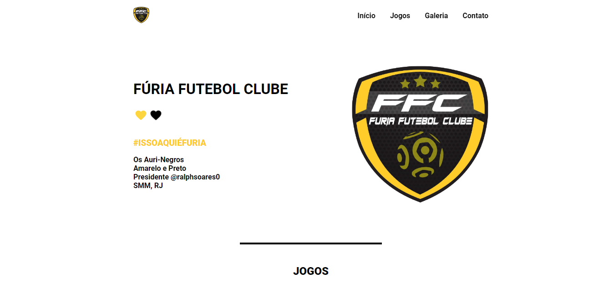

# Fúria Futebol Clube

Projeto de criação de um Site Landing page do Fúria FC um time de futebol amador de Santa Maria Madalena/RJ.

[Cliquei aqui para acessar](https://furiafc.netlify.app/)

## 🛠️ Tecnologias

- HTML
- CSS
- JavaScript
- Git e Github

## 🚀 O que usei
- Usei conceitos de responsividade, transform, animação com CSS, grid e flexbox e criação de função e variável no JavaScript.

## 🖤 Contato

https://jmjuniordeveloper.netlify.app/

https://www.linkedin.com/in/jmjuniordeveloper/

https://www.instagram.com/jmjuniordeveloper/

jmjuniormonteiro@gmail.com
